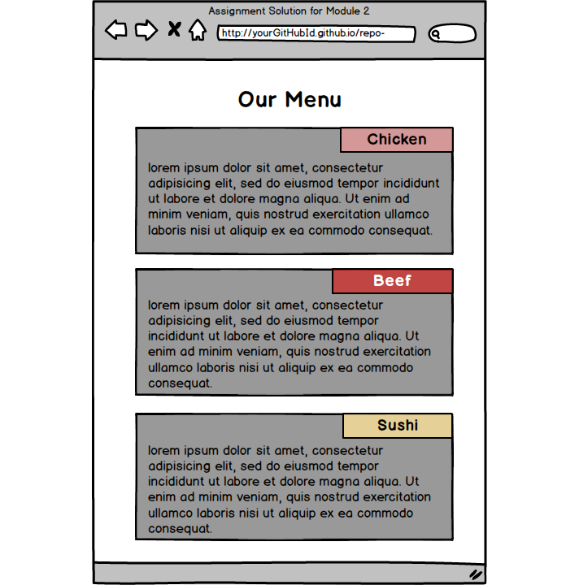

# Module 2 - Assignment 2 - (1 week)
Starting assignment numbering from 2 so it’s easier to correlate the assignment number with the module in the course.

Woo-hoo! You get to do some coding! Exciting!

>Time to complete: 1-2 hours. It may take you less time than that if you’ve absorbed the material in this module well.

Don’t get scared by the number of points below. It’s really not so much. I just wanted to explain everything as clearly as I could and break it down into smaller steps.

Here is what you will need to complete the assignment:

- [x] (If you haven’t already) Create a GitHub.com account and a repository that you will use for this class.

- [x] (If you haven’t already) Follow the Development Setup Video (beginning of Module 1) instructions on how to create a repository and set it up such that you can host and view your finished web pages on GitHub Pages, i.e., GitHub.io domain name. You will need to provide that URL for your Canvas submission.

- [x] Create a folder in your repository that will serve as a container folder for your solution to this assignment. You can call it whatever you want. For example, module2-solution or mod2_solution, etc. Create an index.html file inside the solution container folder, e.g., module2-solution/index.html.

- [x] The implementation of the page you will be creating should follow the mockup illustrations shown below. You are provided 3 mockups: desktop, tablet, and mobile. Your implementation has to be JUST 1 page, NOT 3 pages. In other words, you will be creating a single, responsive page.

- [x] Your page must include a CSS file. No inline styles allowed. Your CSS file should be placed into a css folder under the solution container folder, e.g., module2-solution/css.

- [x] You are NOT allowed to use any CSS (or Javascript) framework for this assignment, including Twitter Bootstrap CSS Framework. No framework CSS files should even be referenced in your index.html, even if you are not using them. However, you MAY use the simple responsive framework we developed in Lecture 24 as a starting point for this assignment.

- [ ] You must implement the following breakpoints that will be considered desktop, tablet, and mobile. The browser should display a desktop version of the site when the width of the browser window is 992px and above. Tablet view should appear only if the width of the browser window is between 768px and 991px, inclusively. Mobile view should appear only if the width of the browser is equal to or less than 767px.

- [ ] Your site is very simple. It consists of a page heading and 3 sections (all in one row in the desktop view). Each section contains some text. You can make it dummy text/”lorem ipsum”, it doesn’t matter. How the sections are laid out on the screen depends on the width of the browser window. (Hint: use media queries discussed in Lecture 23.)

- [ ] Layout: In the desktop view (992px and above), each of the 3 sections should take up equal amount of space on the screen. As you make the browser window wider or narrower, each section should become wider or narrower. (Hint: use percentages to define width and use the ‘float’ property. See Lecture 24). For a visual reference of this view, see the desktop mockup illustration below.

- [ ] Layout: In the tablet view (between 768px and 991px, inclusively), the first 2 sections should be in the first row and be of equal size. The 3rd section should be in the second row and take up the entire row by itself. For a visual reference of this view, see the tablet mockup illustration below.

- [ ] Layout: In the mobile view (equal to or less than 767px), each section should take up the entire row. For a visual reference of this view, see the mobile mockup illustration below.

- [ ] Section title region: Each section should have a section title region that is always positioned at the top right corner of the section no matter the view (desktop, tablet or mobile). Copy the titles from the mockup illustration (i.e., Chicken, Beef, Sushi) or come up with your own. (Hint: use relative and absolute positioning and offsets as discussed in Lecture 22.)

- [ ] Spacing: Pay attention to the spacing shown in the mockup illustrations. Note the spacing between sections (both horizontal and vertical). Note the horizontal spacing between the edges of the section and the edges of the browser window. Also, note the spacing between the dummy text in each section and the edges of the section. Lastly, make sure the dummy text is “pushed down” enough so it doesn’t overlap the section title region. (Hint: use margins and padding and use border-box as your box-sizing as discussed in Lecture 19.)

- [x] Borders and Colors: Each section should have a background color set to some color (of your choosing). Set the background color of each section title region to some unique color (of your choosing). Make sure that the background color still allows the user to view the text in the section and section title regions. Depending on the color you choose, you may want to change the color of the text so it can be easy to read. Set a black border on both the section and section title region that is 1px thick. Warning: While not specifying borders and colors according to the requirements does not hurt your grade so much, not doing so will make it much harder for the grader to grade the rest of your assignment, possibly resulting in a much lower grade.

- [ ] (OPTIONAL) You will NOT be graded on this, but you may want to explicitly set a font-family for the text in your page, so you are not stuck with the default browser font family. Also, set the font size of the heading and section title to be 75% larger and 25% larger (respectively) than the font size of the dummy text.

Here is the mockup illustration of the desktop version of the site. Your final result should look very close to this mockup.

Here is the mockup illustration of the tablet version of the site. Your final result should look very close to this mockup. Note that in this view, the 3rd section takes up the entire row.

Here is the mockup illustration of the mobile version of the site. Your final result should look very close to this mockup.

---

- In addition to that, implement the following (still no Bootstrap allowed):
    - [ ] In the mobile view only, the “Menu” title should disappear. Instead, another title with words “Categories” should appear. It should be in a smaller and different family font than the original “Menu” title. It should also be left aligned. Its left edge should align to the edge of the first content box below.

    - [ ] Constrain the height of each of the boxes. Place enough content into each box such that the content would NOT fit into that box. The extra content should not be shown in any of the views (desktop, tablet, mobile). However, when the user hovers over the box, the cursor should change to a “resize” type cursor and the user should be able to scroll through the content within the box. Show the vertical scrollbar ONLY when the user hovers over the box. If the user’s mouse leaves the box, the scrollbar should disappear.

  - [ ] In mobile view only, the titles of each box (Chicken, Sushi, Beef) should fill up the entire width of the box (instead of just to part of it to the right as shown in mockups) and the text in the title box should be centered. It should also consist of 10 different words. (You can come up with your own, say a description of the type of Chicken it is, etc.). Make sure the title does not overlap the content in the box. This setup (together with a normally large enough font) should cause the title not to fit on 1 line. Make sure it wraps properly without overlapping the content of the box while still maintaining the same distance between the title and the beginning of the content in that box.

## Submission

Submit the assignment on Canvas with the following information:

1) GitHub.com link to your repository (do NOT share this link or your GitHub username with the class)

2) GitHub.io link to the deployed solution.

3) Make sure to check that your deployed assignment works as you intended it to.

Refer to the Syllabus for more info on the assignment submission process.

## Due date

Assignment is due next Tuesday at 11:59pm (1-week assignment). Check Canvas for the exact date.