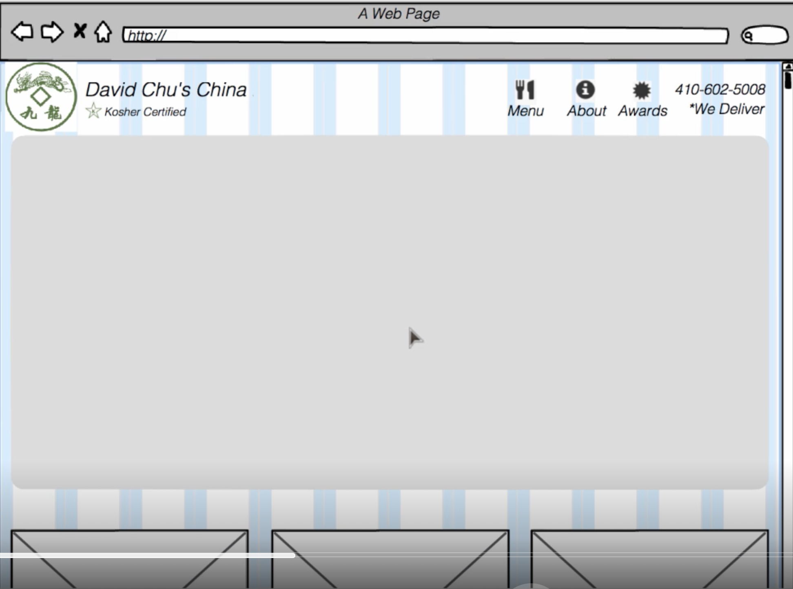
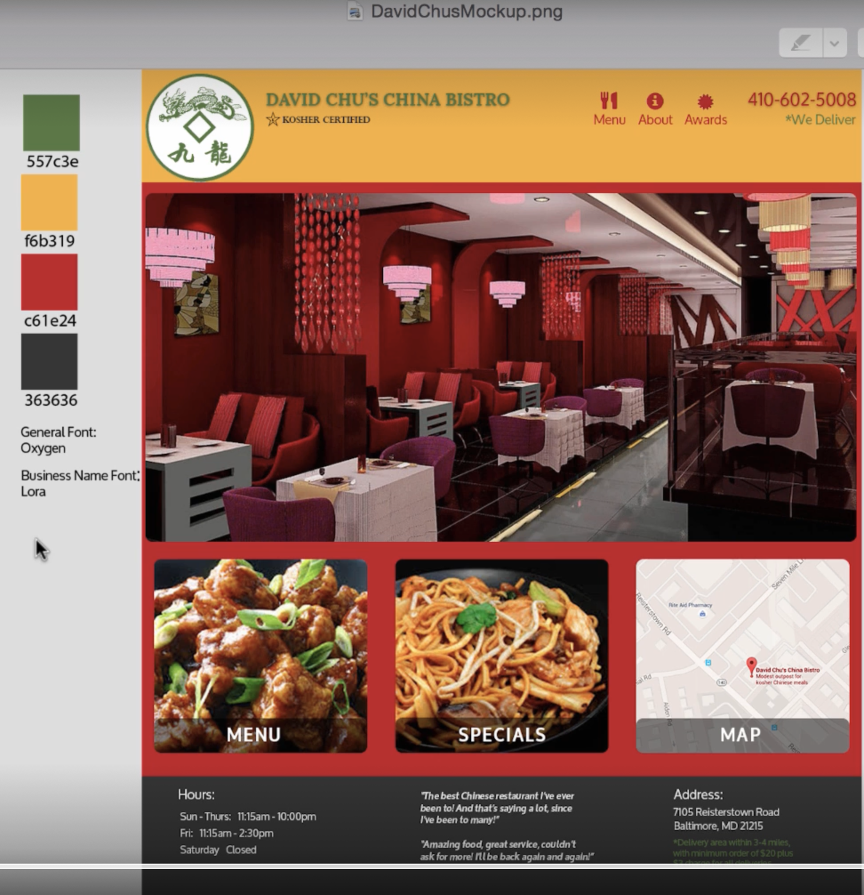

# Module 3

## Visit with the Client

[Link to Lecture 27](../course_materials/fullstack-course4/examples/Lecture27/)

Basic ground rules
1. Most clients have NO IDEA what they want
   1. Usually don't know what they want on their site
   2. Bring website examples of similar businesses
2. Many things are important for them
   1. When everything is important, nothing is
   2. Less (information) is more
   3. Encourage your client to not cram information.
   4. ID the most punchy information
3. Find a way for the client to invest in the project
   1. Client should feel like they have skin in the game
      1. Otherwise you're a side project
   2. Have them commit to pay for product photography for example
4. Have client designate ONE PERSON responsible for decisions
   1. Otherwise everyone has an opinion
   2. You're responsible to that person, if they approve then you can incorporate it
5. Limit the number of revisions UPFRONT
   1. If its paid, then limit the number of free revisions and then per hour after that
6. Google - Web development client questionnaire
7. Involve others if needed
   1. If you're not a graphic designer, then contact a local college
      1. See if they want a resume item
8. Get an idea of what the client has right now

**Fieldtrip**

This meeting is all about setting expectations
- What we are to provide
- What they are to provide and pay for

He interviews the food 
- Kosher

> If you had to do any self criticism, what would you improve

> Brought a couple of example websites, wants her to see what she wants it to be
- Colors, clean
- User friendly
- Practical
- She really likes the picutes

He also said that her website is going to certainly look different, more to what she wants in color and content

Asks for a person responsible, she is the decider.

Lays out the expectations of what will happen
1. Will make a mockup of the website (explained as a drawing)
2. We will show it to you and see if you approve of the way its going
3. We'll give you three revisions, three times she can update the mockup

Q: Would you be able to commit to providing the entire menu of the restaurant so we (The professor) can provide photography

Q: This is a kosher restaurant, what does that mean in terms of cooking

-Does a little bit to build rapport-
Mentions he talked to customers

Q: This restaurant is cozy, do you want that to be the vibe of the restaurant

## Design Overview 

Worst thing is to start coding right away

You want to have some layout mockups that take little to no time to design

Once you've got your mockups, then you turn to the coding

[Balsamiq Mockup](https://balsamiq.com)

Mockup 
1. There is a nav with
   1. Logo
   2. Nav
2. Front page has
   1. Jumbotron



3. Underneath are three buttons
   1. Menu
   2. Specials
   3. Map
4. Footer
   1. Hours
   2. Quote
   3. Address

On a mobile page
1. we'd want a menu icon.
2. Phone number is up front

Try to stick with google fonts, for going with free font


- This mockup contains the color theme and fonts

Professional designers use photoshop, but you can use powerpoint

## Some Ground Rules and Overview of Setup

[Link to Lecture 29](../course_materials/fullstack-course4/examples/Lecture29/)

Based on the mockup

```css
body {
    font-size: 16px;
    color: #fff;
    background-color: #61122f;
    /* Simply putting the font won't work at first, because its not there. */
    font-family: 'Oxygen', sans-serif;
}
```

Can get the font from [Google Fonts](https://www.google.com/fonts)

## Coding Basics of Navbar Header

[Link to Lecture 30](../course_materials/fullstack-course4/examples/Lecture30/)

Bootstrap does this a lot, it has a base class and then a subclass

```css
body {
    font-size: 16px;
    color: #fff;
    background-color: #61122f;
    /* Simply putting the font won't work at first, because its not there. */
    font-family: 'Oxygen', sans-serif;
}

/* HEADER */
#header-nav {
    background-color: $f6b319;
    border-radius: 0;
    border: 0;
}

#logo-img {
    background: url('../images/...') no-repeat;
    width: 150px;
    height: 150px;
    margin: 10px 15px 10px 0;
}
```

```html
<nav id="header-nav" class="navbar navbar-default">
    <!-- Does not have the extra padding, but fits to the page -->
     <!-- This will be header container -->
    <div class="container">
        <!-- We have a new element, the header -->
         
         <div class="navbar-header">
            <a href="index.html" class="pull-left">
                <div id="logo-img" alt="Logo Image"></div>
            </a>

            <!-- Name/Branding -->
             <div class="navbar-brand">
                <a href="index.html"><h1>David Chu's China Bistro</h1></a>

                <p>
                    
                    <span>Kosher Certified</span>
                </p>
            </div>
        </div>
    </div>
</nav>
```

The logo, and brand flow vertically because they are all divs. So you can apply a class called `pull-left` on the first element in the row.

notable css
- text-shadow
- text-decoration (remove link line)

`visible-md`: This element should only be visible at a particular break point

## Coding Button for Future Collapsible Menu

[Link to Lecture 31](../course_materials/fullstack-course4/examples/Lecture31/)

```html
<nav id="header-nav" class="navbar navbar-default">
    <!-- Does not have the extra padding, but fits to the page -->
     <!-- This will be header container -->
    <div class="container">
        <!-- We have a new element, the header -->
         
         <div class="navbar-header">
            <a href="index.html" class="pull-left">
                <div id="logo-img" alt="Logo Image"></div>
            </a>

            <!-- Name/Branding -->
             <div class="navbar-brand">
                <a href="index.html"><h1>David Chu's China Bistro</h1></a>

                <p>
                    
                    <span>Kosher Certified</span>
                </p>
            </div>

            <!-- Toggle -->
             <button type="button" class="navbar-toggle collapsed" data-toggle="collapse" data-target="#collapsable-nav" aria-expanded="false">
                <!-- Screen reader only, doesn't show up -->
                <span class="sr-only">Toggle Navigation</span>
                <span class="icon-bar"></span>
                <span class="icon-bar"></span>
                <span class="icon-bar"></span>
            </button>
        </div>
    </div>
</nav>
```

Navbartoggle is `relative` and floats to the right

`collapsed` does not exist in bootstrap. It signifies to a bootstrap plugin that this is in a collapsed state.
It is in the JS bootstrap file tho.
`aria-expanded` is a screen reader thing

## Coding Nav Menu Buttons

[Link to Lecture 32](../course_materials/fullstack-course4/examples/Lecture32/)

`collapsed` as well as `navbar-collapsed` are both required

`navbar-right` is very similar to `pull-left` and pull-right.

`hidden-xs` hides when the screen is really small

`tel:PHONENUMBER`: Tells the browser the number

Problem 1: The subheading is flowing past the nav. This is a float issue, and we can use clear on it
Problem 2: We need to make the height of the navbar a little smaller

```css
.navbar-header button.navbar-toggle {
    clear: both;
    margin: -10px;
}
```

```html
<nav id="header-nav" class="navbar navbar-default">
    <!-- Does not have the extra padding, but fits to the page -->
     <!-- This will be header container -->
    <div class="container">
        <!-- We have a new element, the header -->
         
         <div class="navbar-header">
            <a href="index.html" class="pull-left">
                <div id="logo-img" alt="Logo Image"></div>
            </a>

            <!-- Name/Branding -->
             <div class="navbar-brand">
                <a href="index.html"><h1>David Chu's China Bistro</h1></a>

                <p>
                    
                    <span>Kosher Certified</span>
                </p>
            </div>

            <!-- Toggle -->
             <button type="button" class="navbar-toggle collapsed" data-toggle="collapse" data-target="#collapsable-nav" aria-expanded="false">
                <!-- Screen reader only, doesn't show up -->
                <span class="sr-only">Toggle Navigation</span>
                <span class="icon-bar"></span>
                <span class="icon-bar"></span>
                <span class="icon-bar"></span>
            </button>
        </div>

        <div id="collapsable-nav" class="collapse navbar-collapse">
           <ul id="nav-list" class="nav navbar-nav navbar-right">
            <li>
              <a href="menu-categories.html">
                <span class="glyphicon glyphicon-cutlery"></span><br class="hidden-xs"> Menu</a>
            </li>
            <li>
              <a href="#">
                <span class="glyphicon glyphicon-info-sign"></span><br class="hidden-xs"> About</a>
            </li>
            <li>
              <a href="#">
                <span class="glyphicon glyphicon-certificate"></span><br class="hidden-xs"> Awards</a>
            </li>
            <li id="phone" class="hidden-xs">
              <a href="tel:410-602-5008">
                <span>410-602-5008</span></a><div>* We Deliver</div>
            </li>
          </ul><!-- #nav-list -->
        </div><!-- .collapse .navbar-collapse -->

    </div>
</nav>
```

## Fixing the Navbar Layout, Text, and Dropdown Menus

[Link to Lecture 33](../course_materials/fullstack-course4/examples/Lecture33/)

When the screen is shortened width/wise. The icons the nav move to the next row. We don't want that to happen.

When we get to the small screen, the kosher title loads below the nav

The glyphcon and font are different sizes
- the glyphicon is getting its font size from the nav (inherited)

What is vw? It is viewport width. 1 unit of vw is equal to 1% of viewport width
- Its a responsive unit

So we need to write out media queries to adjust how it looks
- these ranges are from bootstrap

1. We are targetting the logo-img to load a smaller restaurant image
2. For extra small, 
   1. we want the padding to decrease a little bit on the brand
   2. The rest. name padding will decrease a little bit
   3. We want the kosher to be smaller, and have a smaller margin
   4. Everything gets smaller basically
3. Override the inheritted font size for the glyphicon

```css
/* Part 2 */

#collapsable-nav a span {
    font-size: 1em;
    margin-right: 5px;
}
...
/* Part 1 */
/********** Large devices only **********/
@media (min-width: 1200px) {

}

/********** Medium devices only **********/
@media (min-width: 992px) and (max-width: 1199px) {
  /* Header */
  #logo-img {
    background: url('../images/restaurant-logo_medium.png') no-repeat;
    width: 100px;
    height: 100px;
    margin: 5px 5px 5px 0;
  }
  /* End Header */
}

/********** Small devices only **********/
@media (min-width: 768px) and (max-width: 991px) {

}

/********** Extra small devices only **********/
@media (max-width: 767px) {
  /* Header */
  .navbar-brand {
    padding-top: 10px;
    height: 80px;
  }
  .navbar-brand h1 { /* Restaurant name */
    padding-top: 10px;
    font-size: 5vw; /* 1vw = 1% of viewport width */
  }
  .navbar-brand p { /* Kosher cert */
    font-size: .6em;
    margin-top: 12px;
  }
  .navbar-brand p img { /* Star-K */
    height: 20px;
  }

  #collapsable-nav a { /* Collapsed nav menu text */
    font-size: 1.2em;
  }
  #collapsable-nav a span { /* Collapsed nav menu glyph */
    font-size: 1em;
    margin-right: 5px;
  }

  #call-btn > a {
    font-size: 1.5em;
    display: block;
    margin: 0 20px;
    padding: 10px;
    border: 2px solid #fff;
    background-color: #f6b319;
    color: #951c49;
  }
  #xs-deliver {
    margin-top: 5px;
    font-size: .7em;
    letter-spacing: .1em;
    text-transform: uppercase;
  }
  /* End Header */

}
```

## Coding the Jumbotron

[Link to Lecture 34](../course_materials/fullstack-course4/examples/Lecture34/)

A jumbotron is the main CTA element that can scroll between different pictures.

We have a bunch of images in an `images` folder, and they're all sized differently. We want to substitute different pictures depending on the screen size.
- we need these to stretch and contract
- Start with the smallest image
  - Laptops don't need it but have the capacity to load quickly
  - Phonne not so much, so its best to start with a quick load
`img-responsive`: The width and size of the image are going to change proportionally to the screen size

```css

.container .jumbotron {
    box-shadow: 0 0 50px #3F0C1F;
    border: 2px solid #3F0C1F;
}
/********** Large devices only **********/
@media (min-width: 1200px) {
    /* We are overriding some of the properties that bootstrap had */
    .jumbotron {
        background: url('../images/jumbotron_1200.jpg') no-repeat;
        /* background images don't change the container height so it needs to be specified */
        height: 675px;
    }
}

/********** Medium devices only **********/
@media (min-width: 992px) and (max-width: 1199px) {
    /* logo image */
    ...
    .jumbotron {
        background: url('../images/jumbotron_992.jpg') no-repeat;
        height: 558px;
    }
}

/********** Small devices only **********/
@media (min-width: 768px) and (max-width: 991px) {
    .jumbotron {
        background: url('../images/jumbotron_768.jpg') no-repeat;
        height: 432px;
    }
}

/********** Extra small devices only **********/
@media (max-width: 767px) {
    /* Navbar css */
    ...

    .container .jumbotron {
        /* Default image is used */
        /* Initially this padding won't get used, cause of specifity, so add `.container` */
        padding: 0;
        margin-top: 30px;
    }
}
```

```html
...
  <!-- End of nav section -->

  <!-- Jumbotron -->

  <div id="main-content" class="container">
    <div class="jumbotron">
      
    </div>

  </div>

  <!-- end of page -->

...
```

## Coding Navigation Tiles

[Link to Lecture 35](../course_materials/fullstack-course4/examples/Lecture35/)

Now we're coding the menu, specials and map.

1 2 3

1 2
 3

1
2
3

The sizing of the columns here is very similar to HW 1 & 2

The href is pointing to a different html file

```css
/* Home Page */

#menu-tile, #specials-tile, #map-tile {
    height: 250px;
    /* 100% of the container element */
    width: 100%;
    margin-bottom: 15px;
    margin-right: auto;
    margin-left: auto;
    position: relative;
    border: 2px solid #3F0C1F;
    overflow: hidden;
}

#menu-tile:hover, #specials-tile:hover, #map-tile:hover {
    box-shadow: 0px 5px 1px #CCCCCC;
}

/* These won't cause problems when the element around it shrinks or grows */
#menu-tile {
    background: url('../images/menu-tile.jpg') no-repeat;
    background-position: center;
}

#specials-tile {
    background: url('../images/specials-tile.jpg') no-repeat;
    background-position: center;
}

/* This aligns the tile label */
#menu-tile span, #specials-tile span, #map-tile span {
    /* The span will be positioned absolutely in the tile */
    position: absolute;
    bottom: 0;
    right: 0;
    
    width: 100%;
    text-align: center;
    font-size: 1.6em;
    text-transform: uppercase;
    background-color: #000;
    color: #fff;
    opacity: 0.8;
}


/* End Home Page */

/* Super small devices */
@media (max-width: 479px) {
    /* header */
    .navbar-brand h1 {
        padding-top: 5px;
        font-size: 6vw;
    }
    /* home page */
    #menu-tile, #specials-tile {
        width: 280px;
        margin: 0 auto 15px;
    }
}
```

```html
...

  <!-- End of nav section -->

  <div id="main-content" class="container">
    <!-- Jumbotron -->
    ...

    <!-- Navigation Tiles -->
    <div id="home-tiles" class="row">
        <!-- Menu -->
        <div class="col-md-4 col-sm-6 col-xs-12">
            <!-- This is broken out like this to have different stylings for spacing and what not -->
            <a href="menu-categories.html"><div id="menu-tile"><span>menu</span></div></a>
        </div>

        <!-- Specials -->
        <div class="col-md-4 col-sm-6 col-xs-12">
            <a href="single-category.html"><div id="specials-tile"><span>specials</span></div></a>
        </div>

        <!-- Map -->
        <div class="col-md-4 col-sm-12 col-xs-12">
            <a href="https://www.google.com/maps/place/David+Chu's+China+Bistro/@39.3635874,-76.7138622,17z/data=!4m6!1m3!3m2!1s0x89c81a14e7817803:0xab20a0e99daa17ea!2sDavid+Chu's+China+Bistro!3m1!1s0x89c81a14e7817803:0xab20a0e99daa17ea" target="_blank">
            <div id="map-tile">
                <iframe src="https://www.google.com/maps/embed?pb=!1m18!1m12!1m3!1d3084.675372390488!2d-76.71386218529199!3d39.3635874269356!2m3!1f0!2f0!3f0!3m2!1i1024!2i768!4f13.1!3m3!1m2!1s0x89c81a14e7817803%3A0xab20a0e99daa17ea!2sDavid+Chu&#39;s+China+Bistro!5e0!3m2!1sen!2sus!4v1452824864156" width="100%" height="250" frameborder="0" style="border:0" allowfullscreen></iframe>
                <span>map</span>
            </div>

            </a>
        </div>
    </div>

  </div>

...
```

## Coding the Footer

[Link to Lecture 36](../course_materials/fullstack-course4/examples/Lecture36/)

We want the footer to stack on a small screen

Add an html comment at the end of a div telling you what this is for

Use a row div, and then three columns across with each content zections
- hours
- address
- testimonials

```css
/* Footer */
.panel-footer {
    margin-top: 30px;
    padding-top: 35px;
    padding-bottom: 30px;
    background-color: #222;
    border-top: 0;
}

/* Targets the row in the footer */
.panel-footer div.row {
    margin-bottom: 35px;
}

#hours, #address {
    line-height: 2;
}

/* 30% increase to any content in spans */
#hours >span, #address > span {
    font-size: 1.3em;
}

#address p {
    color: #557C3E;
    font-size: .8em;
    line-height: 1.8;
}

#testimonials {
    font-style: italic;
}

#testimonials p:nth-child(2) {
    margin-top: 25px;
}

@media (max-width: 767px) {
    .panel-footer section {
        margin-bottom: 30px;
        text-align: center;
    }
    .panel-footer section:nth-child(3) {
        margin-bottom: 0px;
    }
    .panel-footer section hr {
        width: 50%;
    }
}
```

```html
...

    </div><!-- End of #home-tiles -->
  </div><!-- End of #main-content -->

  <footer class="panel-footer">
    <div class="container">
      <div class="row">
        <section id="hours" class="col-sm-4">
          <span>Hours:</span><br>
          Sun-Thurs: 11:15am - 10:00pm<br>
          Fri: 11:15am - 2:30pm<br>
          Saturday Closed
          <hr class="visible-xs">
        </section>
        <section id="address" class="col-sm-4">
          <span>Address:</span><br>
          7105 Reisterstown Road<br>
          Baltimore, MD 21215
          <p>* Delivery area within 3-4 miles, with minimum order of $20 plus $3 charge for all deliveries.</p>
          <hr class="visible-xs">
        </section>
        <section id="testimonials" class="col-sm-4">
          <p>"The best Chinese restaurant I've been to! And that's saying a lot, since I've been to many!"</p>
          <p>"Amazing food! Great service! Couldn't ask for more! I'll be back again and again!"</p>
        </section>
      </div>
      <div class="text-center">&copy; Copyright David Chu's China Bistro 2016</div>
    </div>
  </footer>

...
```

## Coding the Menu Categories

[Link to Lecture 37](../course_materials/fullstack-course4/examples/Lecture37/)

We need to let the user know where they are

All the content goes in one row

How do you do a six cell layout? Each div needs to cover 2 cells `col-md-2`. but that doesnt look good so we use `col-md-3`

We can define a new breakpoint, `xxs`

```css
.category-tile { 
  position: relative;
  border: 2px solid #3F0C1F;
  overflow: hidden;
  /* Same trick from before on centering */
  width: 200px;
  height: 200px;
  margin: 0 auto 15px;
}
/* Trying to give the similar style as the homepage boxes */
.category-tile span {
  position: absolute;
  bottom: 0;
  right: 0;
  width: 100%;
  text-align: center;
  font-size: 1.2em;
  text-transform: uppercase;
  background-color: #000;
  color: #fff;
  opacity: .8;
}
/* Make it look clickable */
.category-tile:hover {
  box-shadow: 0 1px 5px 1px #cccccc;
}

#menu-categories-title + div {
  margin-bottom: 50px;
}

/********** Super extra small devices Only :-) (e.g., iPhone 4) **********/
@media (max-width: 479px) {
  /* Header */
  
  /* Home page */
  #menu-tile, #specials-tile {
    width: 280px;
    margin: 0 auto 15px;
  }

  .col-xxs-12 {
    position: relative;
    min-height: 1px;
    padding-right: 15px;
    padding-left: 15px;
    float: left;
    width: 100%;
  }
}
```

```html
<!-- Different html -->
...
<!-- Header -->
<div id="main-content" class="container">
    <!-- Let the user know the page they're on -->
    <h2 id="menu-categories-title" class="text-center">Menu Categories</h2>
    <div class="text-center">
      Substituting white rice with brown rice or fried rice after 3:00pm will be $1.50 for a pint and $2.50 for a quart.
    </div>

    <section class="row">
      <div class="col-md-3 col-sm-4 col-xs-6 col-xxs-12">
        <a href="single-category.html">
          <div class="category-tile">
            
            <span>Lunch</span>
          </div>
        </a>
      </div>
      <div class="col-md-3 col-sm-4 col-xs-6 col-xxs-12">
        <a href="single-category.html">
          <div class="category-tile">
            
            <span>Lunch</span>
          </div>
        </a>
      </div>
      <div class="col-md-3 col-sm-4 col-xs-6 col-xxs-12">
        <a href="single-category.html">
          <div class="category-tile">
            
            <span>Lunch</span>
          </div>
        </a>
      </div>
      <div class="col-md-3 col-sm-4 col-xs-6 col-xxs-12">
        <a href="single-category.html">
          <div class="category-tile">
            
            <span>Lunch</span>
          </div>
        </a>
      </div>
      <div class="col-md-3 col-sm-4 col-xs-6 col-xxs-12">
        <a href="single-category.html">
          <div class="category-tile">
            
            <span>Lunch</span>
          </div>
        </a>
      </div>
      <div class="col-md-3 col-sm-4 col-xs-6 col-xxs-12">
        <a href="single-category.html">
          <div class="category-tile">
            
            <span>Lunch</span>
          </div>
        </a>
      </div>
      <div class="col-md-3 col-sm-4 col-xs-6 col-xxs-12">
        <a href="single-category.html">
          <div class="category-tile">
            
            <span>Lunch</span>
          </div>
        </a>
      </div>
      <div class="col-md-3 col-sm-4 col-xs-6 col-xxs-12">
        <a href="single-category.html">
          <div class="category-tile">
            
            <span>Lunch</span>
          </div>
        </a>
      </div>
      <div class="col-md-3 col-sm-4 col-xs-6 col-xxs-12">
        <a href="single-category.html">
          <div class="category-tile">
            
            <span>Lunch</span>
          </div>
        </a>
      </div>
    </section>
<!-- Footer -->
...
```

## Coding the Single Menu Category Page

[Link to Lecture 38](../course_materials/fullstack-course4/examples/Lecture38/)

bootstrap class `active` is used for if a button has been clicked. So we set it to show the user is at this page for example.

we choose small for the item photo. When the screen is small or large we want it to be horizontal

`img-responsive` lets the image responsively change size with the screen.
- alt is to use a background image with different sizes.
- Not needed here because its already a small image

What happens when the description gets taller than the row? Everything gets messed up in the grid.
- You can restrict the number of characters or clip. This is a hard/bad ask of a business owner.
- This is a `responsive column reset`
  - `<div class="clearfix visible-md-block"></div>`

```css
/* The single cell grid */
.menu-item-tile {
  /* separate from the next row */
  margin-bottom: 25px;
}
/* Only shows up on xs */
.menu-item-tile hr {
  width: 80%;
}
/* align to the right, and reduce the Top.bottom margin */
.menu-item-tile .menu-item-price {
  font-size: 1.1em;
  text-align: right;
  margin-top: -15px;
  margin-right: -15px;
}
.menu-item-tile .menu-item-price span {
  font-size: .6em;
}
/* creates separation for the photo */
.menu-item-photo {
  position: relative;
  border: 2px solid #3F0C1F; 
  overflow: hidden;
  padding: 0;
  margin-right: -15px;
  margin-left: auto;
  margin-bottom: 20px;
  max-width: 250px;
}
/* Item Identifier */
.menu-item-photo div {
  position: absolute;
  bottom: 0;
  right: 0;
  width: 80px;
  background-color: #557c3e;
  text-align: center;
}
.menu-item-description {
  padding-right: 30px;
}
h3.menu-item-title {
  margin: 0 0 10px;
}
.menu-item-details {
  font-size: .9em;
  font-style: italic;
}

/* Extra Small Media query */
/********** Extra small devices only **********/
@media (max-width: 767px) {
  #menu-tile, #specials-tile {
    width: 360px;
    margin: 0 auto 15px;
  }

  .menu-item-photo {
    margin-right: auto;
  }
  .menu-item-tile .menu-item-price {
    text-align: center;
  }
  .menu-item-description {
    text-align: center;
}
```
```html
<!-- Different html -->
...
<!-- Header -->
<div id="main-content" class="container">
    <h2 id="menu-categories-title" class="text-center">Lunch Menu</h2>
    <div class="text-center">Lunch is not served until after 1pm.</div>

    <section class="row">
      <div class="menu-item-tile col-md-6">
        <div class="row">
          <div class="col-sm-5">
            <div class="menu-item-photo">
              <div>D01</div>
              
            </div>
            <div class="menu-item-price">$10.95<span> (pint)</span> $14.95 <span>(quart)</span></div>
          </div>
          <div class="menu-item-description col-sm-7">
            <h3 class="menu-item-title">Veal with Mixed Vegetables</h3>
            <p class="menu-item-details">Lorem ipsum dolor sit amet, consectetur adipisicing elit. Eaque inventore esse minima incidunt impedit. Asperiores, voluptatem. Sint aspernatur provident, rem odio dolorem eaque voluptatibus modi reprehenderit minima, itaque cupiditate totam.Asperiores, voluptatem. Sint aspernatur provident, rem odio dolorem eaque voluptatibus modi reprehenderit minima, itaque cupiditate totam.Asperiores, voluptatem. Sint aspernatur provident, rem odio dolorem eaque voluptatibus modi reprehenderit minima, itaque cupiditate totam.</p>
          </div>
        </div>
        <hr class="visible-xs">
      </div>

      <div class="menu-item-tile col-md-6">
        <div class="row">
          <div class="col-sm-5">
            <div class="menu-item-photo">
              <div>D02</div>
              
            </div>
            <div class="menu-item-price">$10.95<span> (pint)</span> $14.95 <span>(quart)</span></div>
          </div>
          <div class="menu-item-description col-sm-7">
            <h3 class="menu-item-title">Veal with Mixed Vegetables</h3>
            <p class="menu-item-details">Lorem ipsum dolor sit amet, consectetur adipisicing elit. Eaque inventore esse minima incidunt impedit. Asperiores, voluptatem. Sint aspernatur provident, rem odio dolorem eaque voluptatibus modi reprehenderit minima, itaque cupiditate totam.</p>
          </div>
        </div>
        <hr class="visible-xs">
      </div>
      <!-- Add after every 2nd menu-item-tile -->
      <div class="clearfix visible-lg-block visible-md-block"></div>

      <div class="menu-item-tile col-md-6">
        <div class="row">
          <div class="col-sm-5">
            <div class="menu-item-photo">
              <div>D03</div>
              
            </div>
            <div class="menu-item-price">$10.95<span> (pint)</span> $14.95 <span>(quart)</span></div>
          </div>
          <div class="menu-item-description col-sm-7">
            <h3 class="menu-item-title">Veal with Mixed Vegetables</h3>
            <p class="menu-item-details">Lorem ipsum dolor sit amet, consectetur adipisicing elit. Eaque inventore esse minima incidunt impedit. Asperiores, voluptatem. Sint aspernatur provident, rem odio dolorem eaque voluptatibus modi reprehenderit minima, itaque cupiditate totam.</p>
          </div>
        </div>
        <hr class="visible-xs">
      </div>

      <div class="menu-item-tile col-md-6">
        <div class="row">
          <div class="col-sm-5">
            <div class="menu-item-photo">
              <div>D04</div>
              
            </div>
            <div class="menu-item-price">$10.95<span> (pint)</span> $14.95 <span>(quart)</span></div>
          </div>
          <div class="menu-item-description col-sm-7">
            <h3 class="menu-item-title">Veal with Mixed Vegetables</h3>
            <p class="menu-item-details">Lorem ipsum dolor sit amet, consectetur adipisicing elit. Eaque inventore esse minima incidunt impedit. Asperiores, voluptatem. Sint aspernatur provident, rem odio dolorem eaque voluptatibus modi reprehenderit minima, itaque cupiditate totam.</p>
          </div>
        </div>
        <hr class="visible-xs">
      </div>
      <!-- Add after every 2nd menu-item-tile -->
      <div class="clearfix visible-lg-block visible-md-block"></div>

      <div class="menu-item-tile col-md-6">
        <div class="row">
          <div class="col-sm-5">
            <div class="menu-item-photo">
              <div>D05</div>
              
            </div>
            <div class="menu-item-price">$10.95<span> (pint)</span> $14.95 <span>(quart)</span></div>
          </div>
          <div class="menu-item-description col-sm-7">
            <h3 class="menu-item-title">Veal with Mixed Vegetables</h3>
            <p class="menu-item-details">Lorem ipsum dolor sit amet, consectetur adipisicing elit. Eaque inventore esse minima incidunt impedit. Asperiores, voluptatem. Sint aspernatur provident, rem odio dolorem eaque voluptatibus modi reprehenderit minima, itaque cupiditate totam.</p>
          </div>
        </div>
        <hr class="visible-xs">
      </div>

      <div class="menu-item-tile col-md-6">
        <div class="row">
          <div class="col-sm-5">
            <div class="menu-item-photo">
              <div>D06</div>
              
            </div>
            <div class="menu-item-price">$10.95<span> (pint)</span> $14.95 <span>(quart)</span></div>
          </div>
          <div class="menu-item-description col-sm-7">
            <h3 class="menu-item-title">Veal with Mixed Vegetables</h3>
            <p class="menu-item-details">Lorem ipsum dolor sit amet, consectetur adipisicing elit. Eaque inventore esse minima incidunt impedit. Asperiores, voluptatem. Sint aspernatur provident, rem odio dolorem eaque voluptatibus modi reprehenderit minima, itaque cupiditate totam.</p>
          </div>
        </div>
        <hr class="visible-xs">
      </div>
      <!-- Add after every 2nd menu-item-tile -->
      <div class="clearfix visible-lg-block visible-md-block"></div>

    </section>

<!-- Footer -->
...
```

## Testing the Mobile Version on a real phone

Should have a home button the nav.

Tapping on the "lunch menu" should collapse the nav